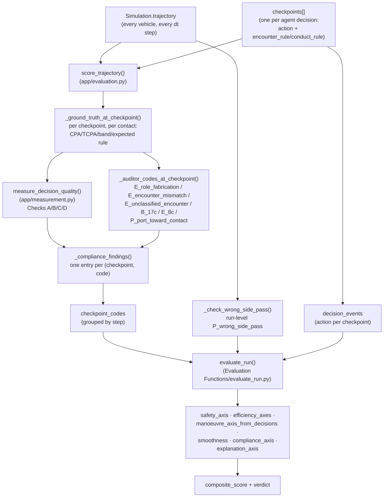

# The OOW Evaluation Function — Design & Component Reference

**Scope:** documents the deterministic, multi-axis scoring function used to grade every
OOW (Officer of the Watch) agent mission run in `Basic Simulator/` — including the Imazu/UM
scenarios run under the Nomoto ship-manoeuvring model (see
`Docs/nomoto_dynamics_design_and_verification.md` for the physics itself). This is the
**same** evaluation function regardless of kinematics engine (legacy turn-rate slew or
Nomoto) or agent (LLM-based configs, fine-tuned models, or the deterministic baselines
— APF/DWA/MPC/rule-tree/Sawada/VO) — it only ever reads a recorded trajectory plus each
checkpoint's self-reported decision, never anything engine-specific.

**Source of truth:** `Basic Simulator/Evaluation Functions/evaluate_run.py` (the actual
scoring math) and `Basic Simulator/app/evaluation.py` (the ground-truth/auditor layer that
feeds it). Every code reference below is exact as of the current `main` branch.

**No LLM call anywhere in this document's pipeline.** Every number described here is pure,
deterministic Python — geometry, thresholds, and counting. The one LLM-based feature in the
same file (`llm_compliance_check()` / STAP 4) is a **separate, opt-in, plain-language
explanation** layer that never judges or re-derives a score — it is out of scope for this
document and is called out explicitly in §7 so it is not confused with the scoring itself.

---

## 1. Big picture: call flow



`score_trajectory()` is the single entry point every caller uses (the live Streamlit app,
`run_llm_scenario.py`, `sweep_llm_params.py`, the baseline runners, and the fine-tuned-model
comparison scripts) — nothing computes its own, second copy of any of this.

---

## 2. The seven scored components

| # | Component | Feeds composite? | What it answers |
|---|---|---|---|
| 1 | **Safety** | Yes (hard gate + weighted) | Did own-ship actually collide, and how close was the nearest miss? |
| 2 | **Compliance** | Yes | Was the physical manoeuvre itself safe and COLREG-correct? |
| 3 | **Explanation compliance** | **Yes** (since 2026-09-29, weight 0.10 -- see §8.2) | Did the model's *stated* rule citation/risk claim match the geometric truth? |
| 4 | **Temporal efficiency** | Yes | Did it reach the goal in a reasonable time vs. a straight-line baseline? |
| 5 | **Spatial efficiency** | Yes | Did it sail a reasonable distance vs. the straight-line distance? |
| 6 | **Manoeuvre (decisiveness)** | Yes | Did it flip-flop between contradictory helm orders? |
| 7 | **Smoothness** | Yes | How gently did the hull actually move (control-effort penalty)? |

Components 2 and 3 are computed from the **same underlying findings list**, split by
category (§6.3) — this is a deliberate 2026-09-24 redesign so that a citation/labelling
mistake alone can never crash the score as hard as an actual unsafe manoeuvre (see §6.4).

---

## 3. Component 1 — Safety axis

**Code:** `safety_axis()`, `min_cpa_over_run()`, `interp_xy()` in `evaluate_run.py`.

**Algorithm (high level):**
1. For every other vehicle, interpolate both own-ship's and that vehicle's position at
   1-second resolution across the whole run (linear interpolation between the recorded
   `dt`-spaced trajectory rows — `interp_xy()`), and take the minimum Euclidean distance
   ever reached (`min_cpa_over_run()`). This is the **realized** trajectory, not any
   agent's *predicted* CPA — it is recomputed independently and can differ from what any
   checkpoint's situation report told the model, e.g. a manoeuvre executed *between* two
   checkpoints can produce a closer pass than either checkpoint's own snapshot predicted.
2. The worst (smallest) such distance across all contacts is `min_cpa_overall`.
3. **Collision gate:** `min_cpa_overall < collision_radius_m` (default 15 m — an actual
   hull-to-hull collision) sets `passed = False`. This is checked **before** everything
   else in `evaluate_run()` and short-circuits the whole composite to `0.0` with verdict
   `"FAIL -- collision occurred"` (§8) — no other axis can rescue a run that actually hit
   something.
4. **Continuous safety score** (2026-09-26 change — see §3.1): even when there was no
   literal collision, `safety_score = min(1.0, min_cpa_overall / safe_distance_m)` — a
   smooth reward for clearing the configured safe-passing distance, capped at 1.0 (no
   extra credit for being *more* than clear — this deliberately avoids rewarding
   over-conservative, wide-berth manoeuvring as if it were better than merely-adequate
   clearance).

### 3.1 Why safety became a weighted term, not just a gate

Before 2026-09-26, `safety` only ever gated the composite (0 on collision, otherwise
untouched) — a near-miss that was *seconds* from an actual collision (e.g. 26.5 m
clearance against a 500 m safe distance) still fed the composite only through one flat,
one-time `-0.30` "cpa_violation" compliance deduction, identical regardless of how close
the call actually was. A `PASS_WITH_CPA_VIOLATION` run at 26.5 m could still score ~0.9.
`safety_score` is now continuous and directly drags the composite down in proportion to
how close the call really was (see the weights table in §8).

---

## 4. Components 4–5 — Temporal & spatial efficiency

**Code:** `efficiency_axes()`, `path_length()` in `evaluate_run.py`.

**Algorithm:**
1. `straight_dist` = straight-line distance from the mission's start to its goal.
   `baseline_time = straight_dist / nominal_speed` (the mission's own rated/nominal speed).
2. Scan own-ship's trajectory for the first instant within `reached_radius_m` of the goal
   → `t_arrival`. If never reached, both axes score **0.0** explicitly (the "stopped/
   endless-detour" failure mode is never left undefined or infinite).
3. **Temporal score:** `time_ratio = time_actual / baseline_time`;
   `temporal_score = clamp(1 / time_ratio, 0, 1)` — 1.0 exactly at the baseline pace,
   decaying (never negative) the longer it takes.
4. **Spatial score:** same shape, but on distance sailed vs. straight-line distance:
   `path_ratio = actual_path_length / straight_dist`;
   `spatial_score = clamp(1 / path_ratio, 0, 1)`. `actual_path_length` is the true
   polyline length of the trajectory up to arrival (`path_length()` — sum of consecutive
   segment lengths), so genuine detours around a contact are correctly counted against it.

---

## 5. Component 7 — Smoothness axis

**Code:** `manoeuvre_and_smoothness_axes()` in `evaluate_run.py`.

**Algorithm:**
1. Walk the recorded trajectory step by step; for each step compute
   `heading_rate = Δheading / Δt` (`heading_delta()` wraps to [-180°, 180°]) and
   `speed_rate = |Δspeed| / Δt`.
2. Average the absolute values across the whole run → `mean_abs_heading_rate`,
   `mean_abs_speed_rate`.
3. `smoothness_hr = clamp(1 - mean_hr / 5.0, 0, 1)`, `smoothness_sr = clamp(1 - mean_sr / 1.0, 0, 1)`
   (5°/s and 1.0 m/s² are the "max reasonable rate" reference constants).
4. `smoothness_score = 0.5 * smoothness_hr + 0.5 * smoothness_sr` — a standard quadratic
   control-effort penalty from optimal control, applied equally to heading and speed.

This is **deliberately kept trajectory-based** (unlike the manoeuvre axis, §5.1) — how
gently the hull actually moved is a genuine, engine-dependent physical fact (Nomoto really
does produce a smoother ride for the same helm orders than the legacy instant-turn-rate
slew, and that difference is worth scoring), not an artifact to correct for.

### 5.1 Why manoeuvre-count moved OFF the trajectory (2026-09-26)

Manoeuvre-count scoring used to live in the same function, inferred from heading-rate
crossing a deadband in the realized trajectory. **Removed** once the Nomoto kinematics
model was introduced: under Nomoto's physically-inertial response, a rapid succession of
contradictory helm orders gets **smoothed into a trajectory whose heading-rate never
crosses the deadband** — so the old counter silently read `0` regardless of how indecisive
the actual decision-making was. Confirmed directly: replaying the *same* rule-tree/Sawada
decisions under the legacy instant-turn engine measured `manoeuvre_count` 37–40; replaying
the identical decisions under Nomoto measured `0`. The fix (§5.2) counts the *decisions*
themselves, never the resulting hull motion.

### 5.2 Component 6 — Manoeuvre (decisiveness) axis, decision-based

**Code:** `manoeuvre_axis_from_decisions()` in `evaluate_run.py`.

**Algorithm:**
1. Input is the chronological list of **decided actions** (one string per checkpoint —
   `"turn_right"`/`"turn_left"`/`"speed_up"`/`"slow_down"`/`"hold_course"`/`"stop"`), not
   the trajectory.
2. Count **contradictions**, not just alterations — per Rule 8(b)'s actual concern (a
   *succession* of alterations, i.e. flip-flopping, not one single decisive change):
   - A `turn_right` immediately (in terms of *last commanded direction*, not necessarily
     the very next entry) following a `turn_left`, or vice versa, counts as one turn
     contradiction. `hold_course` entries do **not** reset "last commanded direction" —
     ordering `turn_right`, then holding for a while, then `turn_left` is still a reversal
     of intent.
   - Symmetrically for `speed_up`/`slow_down`.
3. **Normalize**, replacing an earlier naive fixed-count cap:
   $$\text{rate} = \frac{n_{\text{contradictions}}}{(n_{\text{decision\_opportunities}} - 1) \times n_{\text{contacts}}}$$
   - Dividing by *this run's own* decision-opportunity count means every algorithm is
     judged against its own decision cadence — a reversal at "the very next decision"
     scores the same whether that next decision came 10 s later (a baseline re-deciding
     every step) or 80 s later (an LLM deciding only at sparse checkpoints).
   - Dividing by `n_contacts` (distinct non-own vehicles in the trajectory) accounts for
     busier scenes legitimately giving more reasons to change your mind.
4. `manoeuvre_score = clamp(1 - rate / 0.30, 0, 1)` (`max_reasonable_rate = 0.30`).

A rejected alternative (time-weighting each contradiction more heavily the *sooner* it
followed the opposing order) was dropped: it penalized one well-separated, considered late
correction (e.g. a turn at t=10s, then an opposite correction after 30 minutes of straight
sailing) as the *worst* kind of contradiction, when that is actually the most defensible
kind of behaviour.

---

## 6. Components 2–3 — Compliance & explanation-compliance axes

This is the most involved part of the function — it runs in two stages: (A) turning a
trajectory + checkpoint decisions into a flat list of **coded findings**, then (B) scoring
those findings.

### 6.1 Stage A — building the findings list (`app/evaluation.py`)

For **every checkpoint** (`_compliance_findings()`):

1. **`_ground_truth_at_checkpoint()`** independently recomputes, for every contact at that
   exact instant, using only geometry (never the agent's own claims):
   - `cpa_m`/`tcpa_s` (`app.narrate.cpa_tcpa`, the same CPA/TCPA formula the live prompt
     itself is built from).
   - `band`: one of `"passed"` (TCPA already negative — the closest point is behind us),
     `"safe"` (CPA ≥ the mission's safe distance), `"acute"` (CPA below it AND TCPA inside
     the geometry-derived risk horizon — real_risk()==True), or `"early"` (CPA below it,
     but TCPA beyond the horizon — a real encounter that does not yet mandate action).
   - `encounter`/`own_role` (head-on/crossing-stbd/crossing-port/overtaking/stationary/none,
     via `pipeline.oow_agent_spec.classify_encounter()`), and from that the
     `expected_encounter_rule`/`expected_conduct_rule` (via `classify_rules()`) and
     `expected_direction` (starboard/hold/either/away_from_contact/none).
   - The **decisive contact**: the acute contact with the smallest CPA, or (if none acute)
     the early contact with the smallest CPA, or `None`.
2. **`measure_decision_quality()`** (`app/measurement.py`) — four checks against the
   decision + situation (see §6.2).
3. **`_auditor_codes_at_checkpoint()`** — six more checks against the decision + the
   ground-truth dict from step 1 (see §6.2).
4. Codes from steps 2–3 are merged; if both `A_fabricated_risk` (measurement.py) and
   `E_role_fabrication` (auditor) fired at the same checkpoint — they detect the *same*
   underlying mistake via two independently-written checks — only the more specific
   `E_role_fabrication` is kept, to avoid double-penalizing one error.
5. One finding dict is appended per surviving code: `{code, step, situation_report,
   decision, band, expected_encounter_rule, expected_conduct_rule, expected_direction}`.

A separate, **run-level** check (`_check_wrong_side_pass()`) scans the *realized*
trajectory (not per-checkpoint) for each contact's actual closest-approach instant and
checks the COLREG passing-side convention there:
- **Head-on** (Rule 14): both vessels must alter to starboard → contact must end up on
  own-ship's own **port** side at closest approach; ending up starboard fires
  `P_wrong_side_pass`.
- **Crossing, own give-way** (Rule 15, contact on own's starboard side): own-ship must
  pass **behind** the contact — if the contact is still ahead along own-ship's track
  (positive projection onto own's course vector) at closest approach, fires
  `P_wrong_side_pass`.

And one more run-level code is derived directly inside `evaluate_run()` itself: if the
run did not literally collide but `min_cpa_overall` still fell below `safe_distance_m`
anywhere in the run, a single `cpa_violation` code is appended — a genuine near-miss must
never be silently absorbed into a bare pass.

### 6.2 The ten finding codes

| Code | Source | Fires when |
|---|---|---|
| `A_fabricated_risk` | measurement.py Check A | A rule was cited even though **no** contact is below the safe distance *and* none is on a genuine future collision course (CPA below the distance but TCPA beyond the risk horizon — that case is "early action", not fabrication). |
| `B_wrong_direction` | measurement.py Check B | A give-way turn (`conduct_rule` Rule 14/16, or `encounter_rule` Rule 14/15 as fallback) turned **left** when Rule 14/16 mandates starboard. (`Rule 17`/`Rule 19` conduct are checked first and excluded from this branch, to avoid false positives.) |
| `C_degrees_over_limit` | measurement.py Check C | A turn order exceeds `MAX_SANE_TURN_DEG` (120°) — since turns are no longer physically capped per command, this is a sanity bound (likely a units/reasoning slip), not a hard limit. |
| `D_no_action_when_required` | measurement.py Check D | The decisive contact's band is `"acute"` (real, imminent risk) and the action was `hold_course` — doing nothing here is itself the error. |
| `E_role_fabrication` | auditor | A rule was cited but there is **no** decisive contact at all (every contact banded safe/passed). |
| `E_encounter_mismatch` | auditor | A rule **was** cited, but it doesn't match the decisive contact's `expected_encounter_rule`. |
| `E_unclassified_encounter` | auditor | **No** rule cited even though the decisive contact's geometry expects one. |
| `B_17c` | auditor | Own-ship is the **stand-on** vessel and acted (anything but `hold_course`) while the encounter was still only `"early"`, not yet `"acute"` — Rule 17(a)(i) requires holding until it actually becomes acute. |
| `E_8c` | auditor | `conduct_rule == "Rule 8"` cited for neither a genuine give-way emergency stop (`action == "stop"`) nor a stationary/non-vessel encounter — a misapplied Rule 8 citation. |
| `P_port_toward_contact` | auditor | `turn_left` in an early/acute band, with the decisive contact on own-ship's own **port** side, under an encounter expecting Rule 14/15. |
| `P_wrong_side_pass` | run-level, `_check_wrong_side_pass()` | See §6.1 — wrong COLREG passing side at realized closest approach. |
| `cpa_violation` | run-level, derived in `evaluate_run()` | Realized `min_cpa_overall` fell below `safe_distance_m` anywhere in the run, without an actual collision. |

### 6.3 Stage B — scoring: the manoeuvre/explanation category split

**Code:** `COMPLIANCE_CATEGORY`, `_scored_axis()`, `compliance_axis()`,
`explanation_axis()` in `evaluate_run.py`.

Every one of the ten codes above is tagged **exactly one** of two categories:

| Category | Codes | Answers |
|---|---|---|
| **`manoeuvre`** (→ `compliance_axis()`, feeds composite via `weights["compliance"]`) | `B_wrong_direction`, `C_degrees_over_limit`, `D_no_action_when_required`, `B_17c`, `P_port_toward_contact`, `P_wrong_side_pass`, `cpa_violation` | Was the **physical action** own-ship took safe and COLREG-correct? |
| **`explanation`** (→ `explanation_axis()`, feeds composite via `weights["explanation"]` since 2026-09-29 -- see §6.4/§8.2) | `A_fabricated_risk`, `E_encounter_mismatch`, `E_role_fabrication`, `E_unclassified_encounter`, `E_8c` | Did the model's own **stated** encounter_rule/conduct_rule/"real risk" claim match the geometric ground truth? |

**Algorithm (`_scored_axis()`, shared by both axes):**
1. If the run collided: return `(0.0, [{"code": "collision", "deduction": -1.0}])` — a hard
   gate, identical for both axes (no meaningful citation-accuracy story survives an actual
   collision either).
2. Otherwise start `score = 1.0`.
3. Sort checkpoint-level findings by step, then collapse each **maximal run of
   consecutive checkpoints reporting the same code** into one "episode" (see §6.3.1) —
   subtract that code's fixed weight (`COMPLIANCE_WEIGHTS`, §6.5) once **per episode**,
   scaled by the run's own decision-opportunity normalization factor (§6.3.1), for every
   checkpoint-level finding **whose category matches this axis**.
4. Same for run-level findings (`P_wrong_side_pass`, `cpa_violation`) whose category
   matches — these are already "once per run" by construction, so neither dedup nor
   normalization applies to them.
5. Clip the running total to `[0, 1]`.
6. Return `(score, breakdown)` — `breakdown` is a list of `{code, label, at, deduction}`
   dicts, so every final score is traceable back to the exact findings that produced it.

### 6.3.1 Episode dedup + decision-opportunity normalization (2026-09-28)

**Problem this fixes:** before this change, a code was deducted once **per raw checkpoint
occurrence** — a single, never-corrected mistake that happened to persist across every
checkpoint of a long or densely-sampled run (e.g. the model keeps citing the same
fabricated rule at 40 straight checkpoints) deducted its weight 40 times, crashing the
score to its floor regardless of how mild the underlying mistake actually was, and
regardless of how that same persistent mistake would have scored on a shorter mission or
a sparser decision cadence. This became acutely relevant once baselines moved to the same
adaptive decision cadence as the LLM agent (see `Docs/nomoto_dynamics_design_and_
verification.md` §14.2) — the SAME underlying mistake could now be deducted a very
different number of times purely because of how many decision opportunities one system
happened to have versus another, not because of how many *distinct* mistakes it made.

**Fix, two parts:**
1. **Episode dedup:** a maximal run of consecutive `checkpoint_codes` entries (sorted by
   step) all containing the SAME code collapses into one "episode" — a persistent,
   uncorrected mistake now counts once, not once per checkpoint it spans. A code that
   recurs after being genuinely absent from at least one intervening entry still counts
   as a separate episode (the original per-occurrence design intent is preserved for
   genuinely repeated, distinct mistakes).
2. **Decision-opportunity normalization:** each episode's weight is scaled by
   `min(1.0, REFERENCE_OPPORTUNITIES / n_opportunities)`, where `REFERENCE_OPPORTUNITIES
   = 20.0` (calibrated against a typical calm/short Imazu-scale mission's own checkpoint
   count — matches `app.narrate.recommended_decision_interval()`'s own 20-step
   quiet-mission base) and `n_opportunities = len(decision_events)` for that run. A run
   with substantially MORE decision opportunities than the reference (e.g. a baseline
   re-deciding densely vs. an LLM's sparse adaptive cadence) deducts proportionally LESS
   per distinct episode, so two systems making "the same number of distinct mistakes"
   score comparably regardless of how dense their own decision cadence happens to be.

`compliance_axis()`/`explanation_axis()` both gained an optional `n_opportunities=None`
parameter — omitted (any pre-existing caller that never passes it, e.g. a bare-CSV CLI
invocation with no `decision_events`) falls back to `normalize=1.0`, i.e. byte-identical
to the old per-occurrence-not-episode behaviour **minus** the dedup fix, which always
applies regardless of whether normalization is active. `evaluate_run()` itself always
passes `n_opportunities=len(decision_events) if decision_events else None`.

### 6.4 Why the split exists

Before 2026-09-24, both categories were blended into one `compliance_axis()` — a single
citation/labelling mistake (e.g. a perfectly safe `hold_course` mislabelled with a
fabricated rule) crashed the score exactly as hard as an actual unsafe manoeuvre into a
contact. Measured on a real 71-run batch: average blended compliance was 0.133, with 52/69
runs crushed to exactly 0.0 — dominated by `explanation`-category noise
(`E_role_fabrication` 481 occurrences, `A_fabricated_risk` 459, vs. only 80
`B_wrong_direction` and 52 `D_no_action_when_required` occurrences across the same batch).
After the split: average **manoeuvre** compliance rose to 0.556 and only 15/69 runs were
still at 0.0 — a much more faithful signal of actual physical safety.
`explanation_axis()`'s score is reported alongside compliance (`result["explanation_compliance"]`).

> **Update (2026-09-29):** the split itself (two independently-scored axes, never blended
> back into one number) is unchanged and remains the reason `explanation_compliance` can
> never crash `compliance_axis()`'s score. What changed is whether `explanation_axis()`'s
> own score feeds the *composite* — it now does, with its own dedicated weight (0.10),
> after a deliberate design discussion (transparency/self-explanation is itself a
> meaningful signal, not just diagnostic noise). See §8.2 for the weight and rationale.
> Both a citation-accuracy check and (informally, via a one-off Claude-judged experiment)
> a narrative-*richness* check were considered — only the existing deterministic accuracy
> check (`explanation_axis()`) was actually wired in; richness/quality scoring is not
> implemented (would need an LLM-judge call, i.e. real per-checkpoint cost/latency, not a
> free deterministic recompute like everything else in this document).

### 6.5 The weight table

```python
REFERENCE_OPPORTUNITIES = 20.0  # see §6.3.1 -- decision-opportunity normalization base

COMPLIANCE_WEIGHTS = {
    "B_wrong_direction":         0.15,   # manoeuvre
    "P_port_toward_contact":     0.15,   # manoeuvre
    "D_no_action_when_required": 0.15,   # manoeuvre
    "B_17c":                     0.15,   # manoeuvre
    "P_wrong_side_pass":         0.30,   # manoeuvre
    "cpa_violation":             0.30,   # manoeuvre
    "C_degrees_over_limit":      0.03,   # manoeuvre
    "E_role_fabrication":        0.15,   # explanation
    "E_encounter_mismatch":      0.05,   # explanation
    "E_unclassified_encounter":  0.05,   # explanation
    "A_fabricated_risk":         0.03,   # explanation
    "E_8c":                      0.05,   # explanation
}
```
These are hand-set severity weights (not learned/tuned against a labelled set) — a fixed,
per-episode deduction (§6.3.1) starting from a perfect 1.0, so every score is a simple,
auditable subtraction rather than a black-box formula.

---

## 7. Not scored here: the LLM explanation layer

`llm_compliance_check()` (`app/evaluation.py`) is a **separate, opt-in** feature
(`--explain` flag in `run_llm_scenario.py`, off by default) that sends the already-computed
findings list to Claude and asks for a **plain-language explanation** of each one. Its own
system prompt is explicit that "the LLM never judges, scores, or re-derives anything" — it
purely narrates findings that are already final by the time it is ever called. It has zero
effect on `composite_score`, `compliance`, or `explanation_compliance` and is not part of
the scoring pipeline described in this document.

---

## 8. Composite score and verdict

**Code:** `evaluate_run()`'s final section, `DEFAULT_WEIGHTS` in `evaluate_run.py`.

```python
DEFAULT_WEIGHTS = {
    "safety":       0.35,
    "compliance":   0.20,
    "temporal":     0.10,
    "spatial":      0.10,
    "manoeuvre":    0.10,
    "smoothness":   0.05,
    "explanation":  0.10,
}
```

**Decision tree:**

1. **Collision occurred** (`safety_axis()`'s hard gate, §3) →
   `composite = 0.0`, verdict `"FAIL -- collision occurred"`. No other axis matters.
2. **Did not reach the goal** (`efficiency_axes()`'s `arrived == False`, §4) → capped low
   regardless of how clean the partial trajectory looked:
   $$\text{composite} = \min\Big(0.2,\; w_{\text{compliance}}\!\cdot\!\text{compliance} + w_{\text{manoeuvre}}\!\cdot\!\text{manoeuvre} + w_{\text{smoothness}}\!\cdot\!\text{smoothness} + w_{\text{explanation}}\!\cdot\!\text{explanation}\Big)$$
   verdict `"FAIL -- did not reach the goal"`. (Without this cap a vessel that never moves
   trivially earns full marks on manoeuvre-count and smoothness — confirmed in testing to
   otherwise still score ~0.70.)
3. **Reached the goal, no collision** — the normal case:
   $$\text{composite} = w_{\text{safety}}\!\cdot\!\text{safety} + w_{\text{compliance}}\!\cdot\!\text{compliance} + w_{\text{temporal}}\!\cdot\!\text{temporal} + w_{\text{spatial}}\!\cdot\!\text{spatial} + w_{\text{manoeuvre}}\!\cdot\!\text{manoeuvre} + w_{\text{smoothness}}\!\cdot\!\text{smoothness} + w_{\text{explanation}}\!\cdot\!\text{explanation}$$
   verdict is `"PASS"` if the realized `min_cpa_overall` never fell below `safe_distance_m`,
   else `"PASS_WITH_CPA_VIOLATION"` — a genuine near-miss (e.g. 359–395 m against a 500 m
   safe distance) must never be silently reported as a bare, unqualified `"PASS"`.

### 8.2 `explanation` joined the composite (2026-09-29)

From 2026-09-24 (§6.4) until 2026-09-29, `explanation_compliance` was purely informational
— computed and reported but never summed into `composite_score`. Reintroduced with its
own dedicated weight (0.10) after a deliberate discussion: self-reported reasoning
accuracy/transparency is a real, distinct signal worth rewarding on its own (not just a
diagnostic), especially since LLM configs can articulate a genuine causal chain
(geometry → rule → action) that deterministic baselines' terse computation-traces never
attempt — though note `explanation_axis()` itself only scores citation *accuracy* against
ground truth, not narrative *richness* (see §6.4's update box).

The 0.10 weight was taken entirely out of `smoothness` (0.15 → 0.10 → **0.05** final),
not spread across other axes — `smoothness` is a pure control-effort/comfort proxy that
feeds no hard gate and carries no COLREG-correctness signal, making it the least
safety-relevant term to shrink. Every other weight (`safety`, `compliance`, `temporal`,
`spatial`, `manoeuvre`) is unchanged.

**Known asymmetry, worth remembering when comparing baselines to the LLM on this axis:**
every deterministic baseline (`ruletree`/`sawada`/`dwa`/`mpc`/`apf`/`vo`) computes its own
`encounter_rule`/`conduct_rule` via a *direct call* to the same `classify_rules()`
ground-truth classifier `explanation_axis()` checks against — they are not "self-reporting"
in the same sense the LLM is, so they tend to score well on citation accuracy close to "for
free" (measured on one real example: baselines 0.85–0.89 vs. LLM configs 0.75–0.89 — the
gap is real but smaller than a naive "baselines get it free" argument would suggest, since
the auditor's explanation codes check more than the bare rule number).

**All existing `_llm_runs/*.json` run logs (1518 files, local) were rescored in place**
for this weight change — every per-axis score was already stored (nothing needed
resimulating), only the weighted sum combining them changed; 1224 files' `composite_score`
actually changed (mean delta −0.062, since every axis's typical score was higher than
`smoothness`'s near-ceiling ~0.99–0.996 that lost weight). The cloud copy has **not** yet
been synced with this rescore as of this note.

### 8.3 Final result shape

```python
{
  "verdict": str, "composite_score": float,
  "safety":  {"passed": bool, "min_cpa_m": float | None, "score": float},
  "compliance": {"breakdown": [...], "score": float},
  "explanation_compliance": {"breakdown": [...], "score": float},
  "temporal": {"arrived": bool, "time_actual_s", "time_ratio", "temporal_score"},
  "spatial":  {"path_length_m", "path_ratio", "spatial_score"},
  "manoeuvre": {"manoeuvre_count", "manoeuvre_rate", "manoeuvre_score",
                "mean_abs_heading_rate", "mean_abs_speed_rate", "smoothness_score"},
}
```
(`score_trajectory()` additionally attaches `result["compliance"]["findings"]`, the raw
findings list from §6.1, for optional downstream use by `llm_compliance_check()`.)

---

## 9. Why this design applies unchanged to the Nomoto scenarios

Every axis in this document reads only two things: the recorded `{time, vehicle, x, y,
heading, speed}` trajectory rows, and the checkpoint-level self-reported decisions
(`{action, degrees, encounter_rule, conduct_rule}`). Neither depends on *how* the
trajectory was produced — the legacy instant-turn-rate slew and the Nomoto first-order
manoeuvring model (rudder-servo + yaw-rate response, see
`Docs/nomoto_dynamics_design_and_verification.md`) both produce exactly this same row
shape. The one place kinematics-engine choice materially mattered (manoeuvre-count
scoring, §5.1) was identified and fixed by moving that one axis off the trajectory and
onto the decision stream directly — every other axis was already engine-agnostic by
construction.

---

## 10. File map

| File | Role |
|---|---|
| `Basic Simulator/Evaluation Functions/evaluate_run.py` | All scoring math: every axis, the composite formula, the verdict logic. CSV-in, dict-out; no app/LLM dependencies. |
| `Basic Simulator/app/evaluation.py` | `score_trajectory()` — the one entry point every caller uses; builds ground truth, findings, decision events, and run-level codes, then calls `evaluate_run()`. Also `llm_compliance_check()` (§7, out of scope). |
| `Basic Simulator/app/measurement.py` | `measure_decision_quality()` — Checks A/B/C/D. Pure, read-only, never mutates or corrects a decision. |
| `pipeline/oow_agent_spec.py` | Shared, dependency-free geometry/classification (`classify_encounter()`, `classify_rules()`, `real_risk()`, `derive_risk_horizon_s()`) used identically by the evaluator, the live prompt, and the Track-2 training-data generators. |
